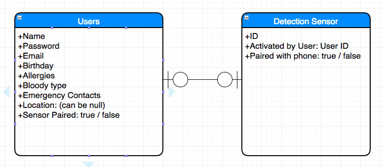
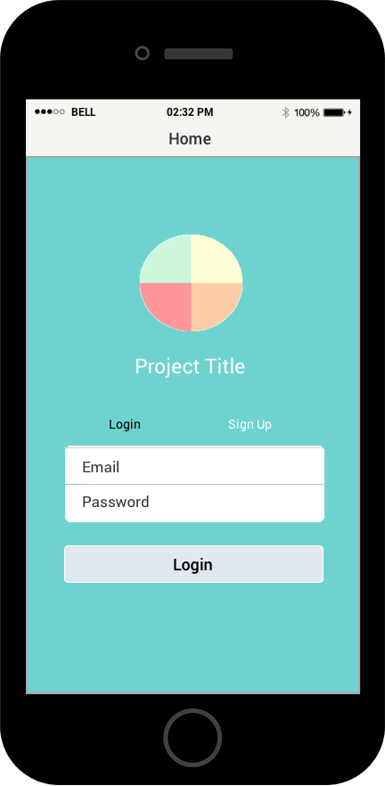
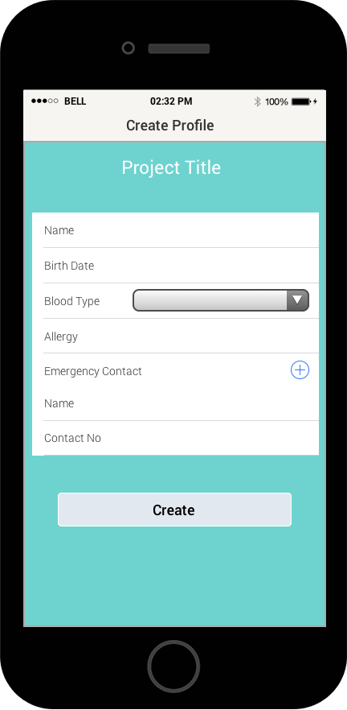
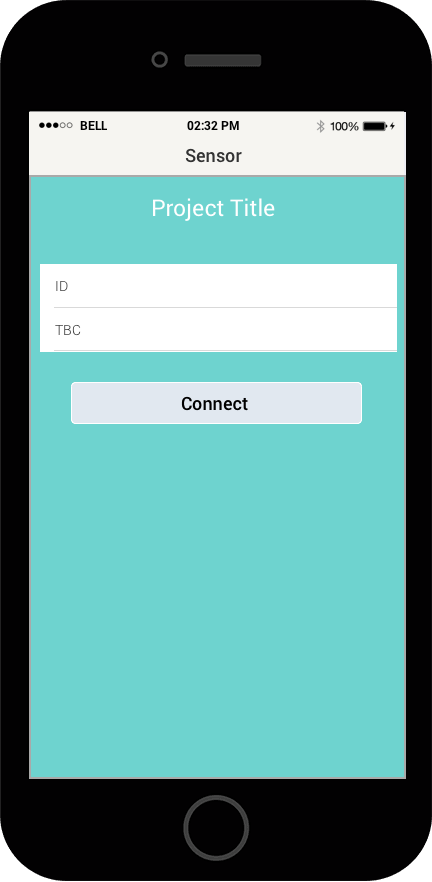
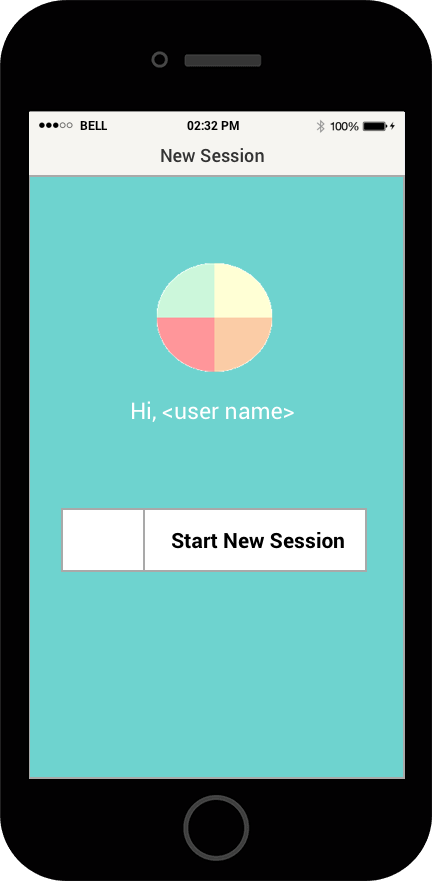
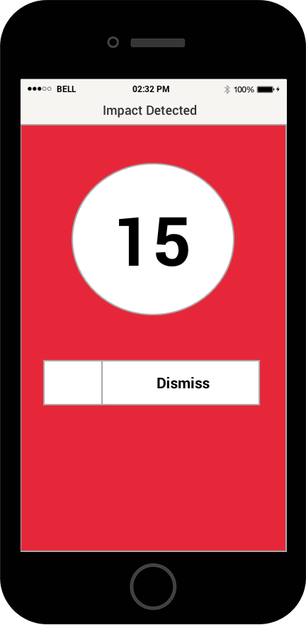
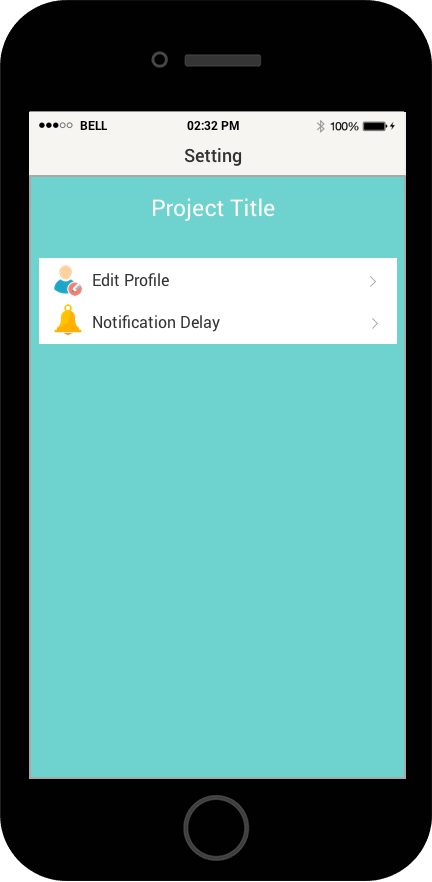
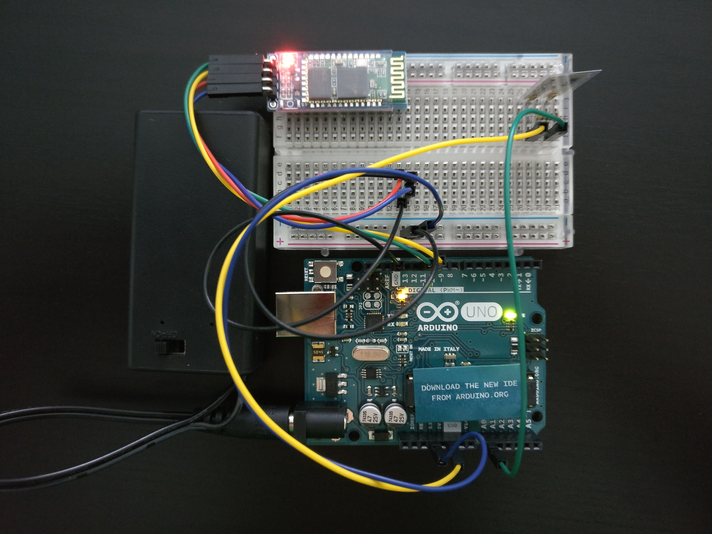

#  Project #4: Glover

Glover is a collision detection device + phone app that will notify your loved ones on your location when you're out cycling, skiing or even driving. The device should be attached somewhere that may sense the impact and this triggers your phone to send out an SMS to your designated emergency contact with your location and other health related details like blood type and allergies.

This project makes use of:

Hardware
* Arduino Uno
* Piezo Sensor
* 1 Mohm resistor
* 9V battery
* Bluetooth module (HC-05)

Software
* React Native
* Bluetooth library to pair with hardware
* GPS library
* Native geolocation
* Communications library to send SMS

## Getting Started

To see a working version of the mobile app, you will need
* Android Studio + emulator
* xCode for iphone

1. Download the codes from this repo
2. Yarn install
3. Run react-native start
4. If your android and iOS environment is setup correctly, simply run
react-native run-ios OR
react-native run-android

## Live Version

Deployed onto hockeyapp, link can be shared by invitation

## ERD

## Wireframe

 

## IOT

## User Stories

* User should be able to register and log-in subsequently
* Registration page will prompt users to key in health details and emergency contacts from phone
* Logged-in users should be able to start session that will trigger pairing of bluetooth device for crash detection and turn on GPS for location sensing
* Upon collision, app will start a 30 seconds countdown that users can dismiss if false-alarm triggered by a bump on the road or a minor accident.
* If user is in a serious accident and is unable to dismiss the countdown, the app will then automatically send out a message to designated contacts with information on location and previously provided health details.

## Challenges

1. How to prompt user to pair bluetooth and switch on GPS upon 'start ride session'?
2. Will locked phone disable sending SMS?
3. Will app running in background continually sense location coordinate and receive bluetooth data?
4. iOS doesn't seem to allow apps to send messages without prompting users to click 'send'

## Future Plans

1. Pairing of IOT! And deployment to Play Store
2. Live-tracking of location & time to enable live updates to emergency contacts even without crash event. This will also enable app to double up as a 'run-keeper' for cyclists, skiiers, motorists or even joggers.
3. Implementation of accelerometer for increased accuracy
4. 'Forget Password' feature
5. Provide settings page to enable users to amend emergency contact details, personal details like allergies, health status

## Authors

* **Wan Zhen** - [thecodingdog](https://github.com/thecodingdog)
* **Shumin** - [shumin13](https://github.com/shumin13)

## Acknowledgments

* To enable direct SMS (not just re-direct you to the SMS function with pre-filled msg)
https://github.com/rhaker/react-native-sms-android

* React-navigation that gives you the router and nav bar
https://github.com/spencercarli/getting-started-react-navigation/blob/master/app/config/router.js

* React-native maps that gives you the ability to see google maps based on supplied coordinates
https://github.com/airbnb/react-native-maps

* Incorporating geolocation (native) to pinpoint current location
https://medium.com/@kswanie21/react-native-google-map-with-react-native-maps-572e3d3eee14

* Deployment to HockeyApp for beta testing
https://github.com/benloopcompany/react-native-hockeyapp

* Tutorials for IOT
http://www.instructables.com/id/How-to-Receive-Arduino-Sensor-Data-on-Your-Android/
https://learn.sparkfun.com/tutorials/piezo-vibration-sensor-hookup-guide
